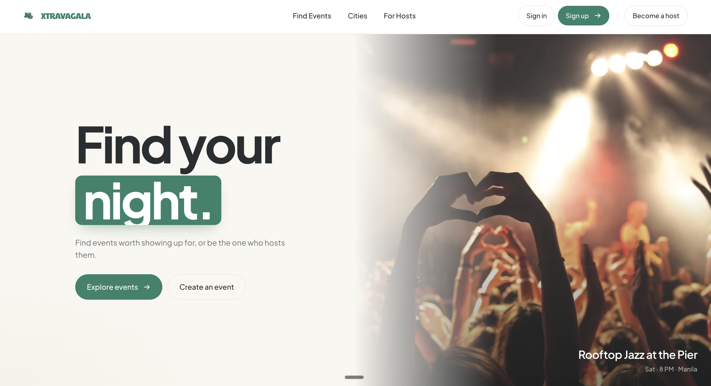
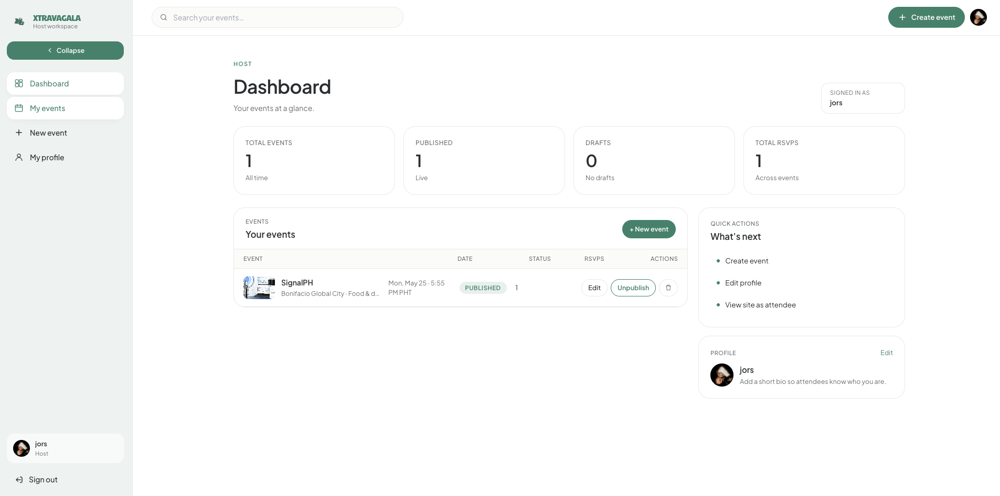

# XtravaGala

> Find events worth showing up for.

XtravaGala is an event discovery and hosting platform for the Philippines. Attendees browse curated events by city and category and RSVP with a single tap; hosts publish events, manage their schedule, and track attendees from a dedicated dashboard.

**Live demo:** [xtravagala.vercel.app](https://xtravagala.vercel.app/)

XtravaGala has two sides: an attendee-facing event discovery experience and a host workspace for publishing events and tracking RSVPs.

## Screenshots

### Event discovery



### Host dashboard



---

## Table of Contents

- [Features](#features)
- [Tech Stack](#tech-stack)
- [Architecture](#architecture)
- [Getting Started](#getting-started)
- [Environment Variables](#environment-variables)
- [Available Scripts](#available-scripts)
- [Project Structure](#project-structure)
- [Database](#database)
- [Testing](#testing)
- [Deployment](#deployment)
- [License](#license)

---

## Features

**For attendees**
- Browse published events filtered by city, category, or free-text search
- Event detail pages with schedule, venue, pricing, and host info
- One-tap RSVP (and un-RSVP) for signed-in users
- Personal profile page with a "My Events" view of upcoming RSVPs

**For hosts**
- Self-service host upgrade flow
- Dashboard listing all owned events with status (draft / published)
- Full event editor: cover image upload, schedule blocks, venue, pricing, capacity
- Draft / publish workflow with delete

**Cross-cutting**
- Email/password auth and Google OAuth sign-in
- Password reset via email
- Avatar upload to Supabase Storage
- Row-Level Security enforced at the database layer — the UI is not the gatekeeper
- Responsive layout with motion-driven micro-interactions

---

## Tech Stack

| Layer | Technology |
|---|---|
| Framework | React 19 + TypeScript |
| Build | Vite |
| Styling | Tailwind CSS v3 with custom design tokens |
| Animation | Framer Motion |
| Routing | react-router-dom v7 |
| Backend | Supabase (Postgres, Auth, Storage) |
| E2E tests | Playwright |
| Hosting | Vercel (frontend) + Supabase Cloud |

---

## Architecture

The frontend talks to Supabase directly via `@supabase/supabase-js`. There is no custom backend server — **Postgres Row-Level Security** policies are the authorization layer.

Key conventions:

- **Data hooks** in `frontend/src/hooks/` wrap every Supabase query. Components never call the client directly.
- **Database types** in `frontend/src/types/db.ts` are generated from the live schema via `supabase gen types typescript --linked`. Never hand-edited.
- **Schema changes** flow Studio → `supabase db pull` → committed migration file → regenerated types. The repo's `supabase/migrations/` directory is the source of truth for what's in production.
- **Storage** uses two public buckets (`avatars`, `event-covers`) with per-folder ownership policies — a user can only write to a path prefixed with their own `uid`.

---

## Getting Started

### Prerequisites

- Node.js 20+
- npm 10+
- A Supabase project (free tier is fine) — needed for `VITE_SUPABASE_URL` and `VITE_SUPABASE_ANON_KEY`

### Install

```bash
git clone https://github.com/jiro1106/xtravagala.git
cd xtravagala/frontend
npm install
```

### Configure

Create `frontend/.env.local`:

```bash
VITE_SUPABASE_URL=https://<your-project-ref>.supabase.co
VITE_SUPABASE_ANON_KEY=<your-publishable-key>
```

Use the `sb_publishable_...` key (not the legacy anon JWT, and never the `sb_secret_...` service-role key — that one is server-only and must never appear in this project).

### Run

```bash
npm run dev
```

App is now available at [http://localhost:5173](http://localhost:5173).

---

## Environment Variables

| Variable | Required | Description |
|---|---|---|
| `VITE_SUPABASE_URL` | Yes | Your Supabase project URL |
| `VITE_SUPABASE_ANON_KEY` | Yes | Supabase publishable key (`sb_publishable_...`) — safe to ship in the client bundle; RLS gates access |

Both must be prefixed with `VITE_` for Vite to expose them to the client. They are also configured in the Vercel project settings for production.

---

## Available Scripts

From the `frontend/` directory:

| Script | Description |
|---|---|
| `npm run dev` | Start the Vite dev server on port 5173 |
| `npm run build` | Type-check and build for production into `dist/` |
| `npm run preview` | Serve the production build locally |
| `npm run lint` | Run ESLint over the codebase |
| `npm run seed:events` | Seed Supabase with sample events (requires service-role key in env) |
| `npm run test:e2e` | Run Playwright end-to-end tests headlessly |
| `npm run test:e2e:ui` | Run Playwright tests in interactive UI mode |
| `npm run test:e2e:report` | Open the last Playwright HTML report |

---

## Project Structure

```
xtravagala/
├── frontend/                  # React app — deployed to Vercel
│   ├── src/
│   │   ├── components/
│   │   │   ├── auth/          # RequireAuth, RequireHost route guards
│   │   │   ├── layout/        # Header, Footer
│   │   │   └── ui/            # Reusable primitives (Button, EventCard, ...)
│   │   ├── pages/             # One folder per route
│   │   ├── hooks/             # Data hooks wrapping Supabase queries
│   │   ├── context/           # AuthContext
│   │   ├── lib/supabase.ts    # Supabase client singleton
│   │   ├── types/db.ts        # Generated database types
│   │   ├── data/              # Static, typed seed data
│   │   └── index.css          # Design tokens + Tailwind directives
│   ├── e2e/                   # Playwright tests
│   └── scripts/               # One-off scripts (seeders, etc.)
└── supabase/
    ├── migrations/            # SQL schema migrations (source of truth)
    └── config.toml            # Supabase CLI config
```

---

## Database

The schema lives in Supabase Cloud and is mirrored locally as SQL migrations.

Core tables:

- `profiles` — extends `auth.users` with display name, avatar, host flag, admin flag
- `cities` — Philippine cities surfaced in the UI
- `categories` — event categories with inline SVG icons
- `events` — published or draft events owned by a host
- `rsvps` — composite-key join between users and events

Derived views (`events_with_counts`, `cities_with_counts`) use `security_invoker = true` so they respect the caller's RLS on the underlying tables.

**Every table has RLS enabled.** See `supabase/migrations/` for the full policy list.

### Updating the schema

```bash
# 1. Make changes in Supabase Studio (web UI)
# 2. Capture them as a migration
supabase db pull

# 3. Regenerate row types
supabase gen types typescript --linked > frontend/src/types/db.ts

# 4. Commit both files together
```

Never hand-edit `frontend/src/types/db.ts`. Never write migrations blind.

---

## Testing

End-to-end tests are written in Playwright and cover the critical user flows: browse → RSVP, host upgrade, event create/edit/delete.

```bash
cd frontend
npm run test:e2e          # headless
npm run test:e2e:ui       # interactive runner
npm run test:e2e:report   # open the last HTML report
```

---

## Deployment

The frontend is deployed to Vercel from the `main` branch.

Vercel project settings:

- **Root Directory:** `frontend`
- **Build Command:** `npm run build`
- **Output Directory:** `dist`
- **Environment Variables:** `VITE_SUPABASE_URL`, `VITE_SUPABASE_ANON_KEY` (Production scope)

The Supabase project is hosted on Supabase Cloud — no separate deployment step. Schema changes are applied via the Supabase CLI against the linked project.

After deploying, the Vercel domain must be added to the Supabase dashboard under **Authentication → URL Configuration**:

- **Site URL:** the production domain
- **Redirect URLs:** include `/auth/callback` and `/auth/reset-password` for production, preview, and local dev origins

---

## License

This project is not currently licensed for redistribution. All rights reserved.

---

## Author

Built by [Jiro Rafael Layug](https://github.com/jiro1106).
